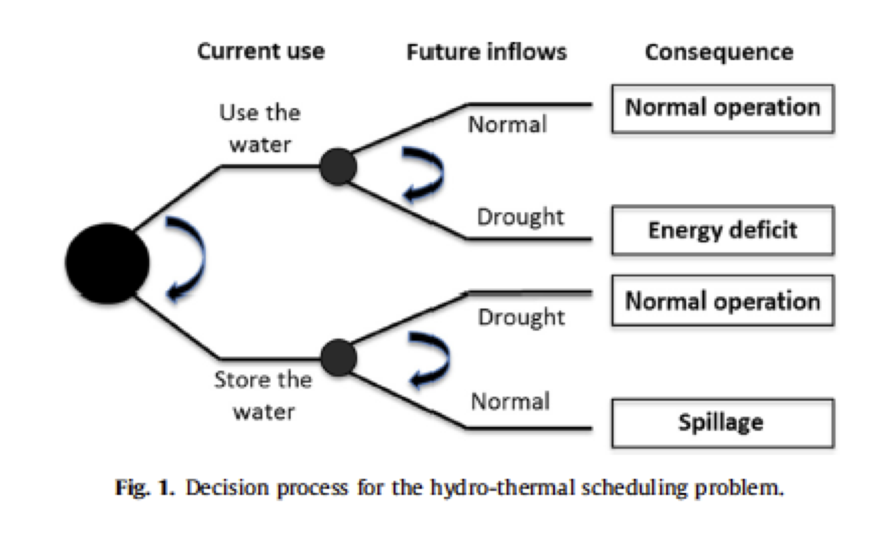

# ddp

## Introduction

A python-based web app that shows the iterative steps to solve a simple 2 stage (t0 and t1)
deterministic dual dynamic programming (ddp) hydro-thermal scheduling problem.
The web app is available at <https://dash-test-ddp.herokuapp.com/>.

The following figure showns the decision tree of this problem \[[1](https://www.sciencedirect.com/science/article/pii/S1364032116300983)\].

This web app is 100% based (a.k.a. copied) on a excel toy example used by [PSR](www.psr-inc.com). 

This toy example contains one hydro generator and three thermal generators with different generation costs. It simulates the optimal dispatch scheduling in t0 taking into account the future cost (in t1) of generation.

The charachteristics of the plants are shown in the following table:

| Generator      | Capacity     |  Cost         | Vmax         | Prod. Factor  |
| :------------- |:-------------| :-------------|:-------------|:-----|
| Hydro          | 11           |  -            | 130          | 0.2  |
| Thermo 1       | 5            |  8            | -            | -    |
| Thermo 2 	     | 5            |  12           | -            | -    |
| Thermo 3       | 20           |  15           | -            | -    |

Additional data:

|                            |              |
| :-------------             |:-------------|
| Load                       | 12 MW        |
| Inflows in 1st stage       | 40 m3/s      |
| Inflows in 2nd stage       | 0 m3/s       |

Initial storage in the reservoir is assumed as being zero.

The formulation of this problem is:

## Contents

### ddp.py

This script has functions to create the LP and process results. It also defines the power plant objects. It uses the CVX solver

- `save_results_df`: converts dictionary with results to a data frame
- `print_summary`: writes dictionary of results as a formatted text table
- `set_lp`: creates LP and returns dictionary with vectors and matrices (in CVX format).
- `compute_line_cut`: computes the resulting new cut after a new iteration to be plotted.

### dash_test.py

This script implements the web app interface using Dash

